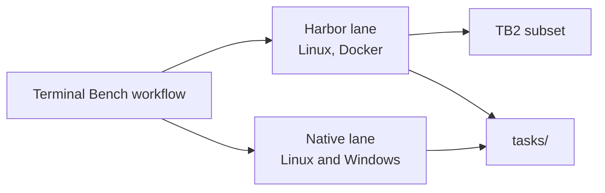
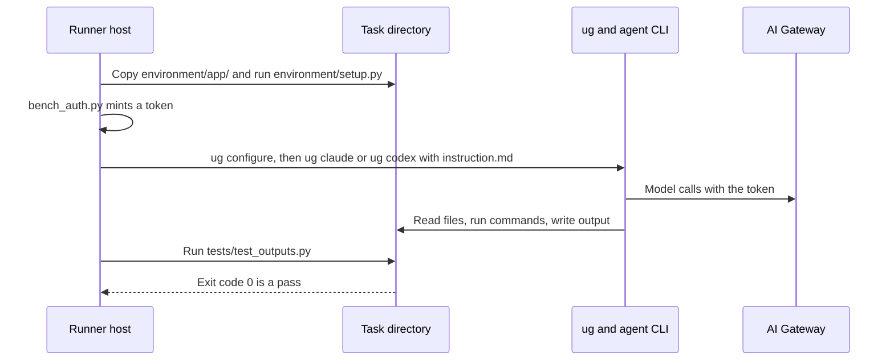

# Terminal Bench for ug

```text
 _                 _           _   _                 _
| |_ ___ _ _ _ __ (_)_ _  __ _| | | |__  ___ _ _  __| |_
|  _/ -_) '_| '  \| | ' \/ _` | | | '_ \/ -_) ' \/ _| ' \
 \__\___|_| |_|_|_|_|_||_\__,_|_| |_.__/\___|_||_\__|_||_|
```

This directory runs Terminal Bench tasks through `ug claude` and `ug codex`. It checks that an agent keeps working when ug configures and launches it. The `Terminal Bench` workflow in `.github/workflows/terminal-bench.yml` runs every night at 07:00 UTC and on manual dispatch.

The workflow runs tasks in two lanes. The Harbor lane runs a [Terminal Bench 2](https://www.tbench.ai/) subset and the tasks in `tasks/` in Docker containers on Linux. The native lane runs the tasks in `tasks/` directly on Linux and Windows runners.



Each lane runs its tasks for Claude and for Codex. [TASKS.md](TASKS.md) describes the task format and lists every task.

## Why there are two lanes

Each lane tests something the other can't.

The Harbor lane exists for real TB2 tasks. Each TB2 task ships a Linux Docker image with the services, packages, and root access it needs. Harbor starts a fresh container per trial, so a task can't change the runner or another trial. `ug_agent.py` installs ug, the Databricks CLI, and the agent CLI in each container.

The native lane exists for Windows. GitHub's Windows runners can't run Linux containers, and TB2 has no Windows images, so Harbor can't test ug on Windows. `run_native.py` runs the tasks in `tasks/` on the runner itself instead. Those tasks use only the Python standard library so they run on both operating systems.

The native Linux job overlaps with Harbor. It adds one thing: ug running outside a container, on a machine with a normal user home.

## How a task runs

Both lanes run a task the same way. The agent gets the task's `instruction.md` once, at launch, and works on its own until it exits or hits the task's `timeout_sec`. Nothing sends it more instructions while it runs. That matches Terminal Bench and Harbor's built-in `claude-code` and `codex` agents, which also launch `claude --print` and `codex exec` with the instruction and wait.

Claude reads the instruction on stdin in print mode (`-p`). Codex gets it as an argument to `codex exec`. The host mints the gateway token, so the agent never sees the service principal secret. The verifier runs after the agent exits and decides the result.



The Harbor lane runs `ug configure` in each container. The native lane runs it once at the start of the job.

A multi-step task launches the agent again for each step, with that step's instruction and a new token. The new launch resumes the previous session with `--continue` for Claude or `exec resume --last` for Codex, and the verifier runs after each step. All TB2 tasks have one step. `resume-session` is the only multi-step task here.

## What the bench doesn't test

The bench treats ug as a black box. It installs ug from this checkout, runs `ug configure`, and launches the agent with `ug claude` or `ug codex`. Verifiers check only what the agent left behind. Some of ug runs differently from a user's setup:

- Auth goes through `DATABRICKS_BEARER` with a token the host mints. ug's `databricks auth login` and OAuth flows don't run.
- Databricks AI Tools, the skills and plugins that `--enable-databricks-ai-tools` installs, aren't installed. That's ug's default.
- The CUJ1 workspace's managed config lists no MCP servers, so ug registers none.
- The harness installs a pinned Claude Code or Codex before ug starts, so ug's agent install doesn't run for that agent. It can still run for the other one. In a Claude job, ug tries to install Codex because the CUJ1 managed config enables both.
- Claude runs with `--dangerously-skip-permissions` and Codex with `--dangerously-bypass-approvals-and-sandbox`. Permission prompts and the Codex sandbox don't run.
- Smart routing is off.

## Run the workflow with other tasks or a model

To change the TB2 tasks or pin a model, dispatch the workflow with inputs:

```sh
gh workflow run terminal-bench.yml -f tb2_tasks=fix-git,code-from-image -f model=<model>
```

The workflow also takes `tb2_dataset`, `claude_version`, and `codex_version`. GitHub can dispatch the workflow only from a file that is already on `main`.

## Read the results

Each job writes a table of task results to its run summary.

A Harbor job fails only when a trial hits a harness error, such as a failed agent install or an API error. A task with reward 0 doesn't fail the job, because TB2 tasks are meant to be hard. A native job fails when fewer than 75% of its tasks pass. Agents miss a different task or two from run to run, so one miss doesn't fail the job. Change the bar with `run_native.py --min-pass-rate`.

Each job uploads its files as an artifact named `terminal-bench-harbor-<agent>` or `terminal-bench-native-<agent>-<os>`. `scrub_secrets.py` replaces bearer tokens in those files before upload.

To tell a ug problem from an agent mistake, read the verifier output first and the agent log second:

- In a Harbor artifact, read `<job>/<trial>/verifier/test-stdout.txt`, then `<job>/<trial>/agent/ug-<agent>.txt`.
- In a native artifact, read `logs/<task>/<step>.verifier.log`, then `logs/<task>/<step>.log`. A single-step task names its step `agent`.

## Run tasks locally

To check the tasks without a gateway, run the reference solutions. Every task passes.

```sh
uv run python bench/terminal_bench/run_native.py --agent oracle --output /tmp/tb
```

Add `--task <name>` to run one task.

To run the tasks through ug, export credentials as described in [Credentials](#credentials) and pick an agent. The runner calls `ug configure` for that agent, so it replaces your own configuration for it.

```sh
uv run python bench/terminal_bench/run_native.py --agent claude --output /tmp/tb
```

To run in Harbor, you need Docker. Build a ug wheel, point `UG_BENCH_WHEEL` at it, and start a job:

```sh
uv build --wheel --out-dir /tmp/dist
export UG_BENCH_WHEEL=$(ls /tmp/dist/*.whl)
PYTHONPATH=bench/terminal_bench uvx --python 3.12 --from harbor==0.23.0 harbor run -y \
	-d terminal-bench@2.0 -i fix-git -a ug_agent:UgClaude -o /tmp/harbor-jobs
```

For Codex, use `ug_agent:UgCodex`. To run ug's own tasks, replace `-d terminal-bench@2.0` with `-p bench/terminal_bench/tasks --resume-trajectory`.

## Credentials

`bench_auth.py` picks the credentials for each task. If `UG_BENCH_CLIENT_ID`, `UG_BENCH_CLIENT_SECRET`, and `UG_BENCH_SP_WORKSPACE` are set, it mints a new OAuth M2M token on the host before each task. The agent gets that token and never the service principal secret, because the agent has a full shell. If those variables aren't set, it uses `DATABRICKS_BEARER` against `UCODE_TEST_WORKSPACE`.

CI uses the `UG_CUJ_SP_CLIENT_ID` service principal against `UG_CUJ1_WORKSPACE`. That workspace publishes a managed coding-agent config, so its model policy applies to every CI run. The policy doesn't allow haiku, for example.

## Add a task

1. Copy the task in `tasks/` that is closest to yours. [TASKS.md](TASKS.md) describes each file.
2. Write `tests/test_outputs.py` so it checks evidence that only the feature can produce, such as a hook log or an MCP call log, as well as the answer. An agent can read every file in the task, so the answer alone is easy to fake.
3. If only one agent supports the feature, set `agents` under `[metadata]` in `task.toml`.
4. Run `run_native.py --agent oracle --task <name>` and confirm the task passes.
5. Confirm the verifier fails when the agent does nothing. Copy `environment/app/` into an empty directory, or run `environment/setup.py <dir>`. Then run `tests/test_outputs.py` with `TASK_APP_DIR` set to that directory.
